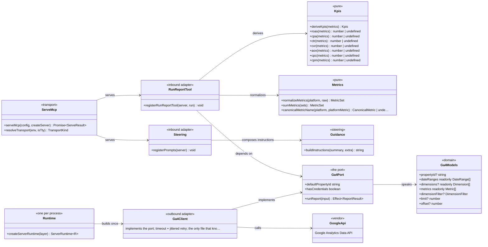

# Analytics MCP stack — class diagram (generated)

The shape every analytics MCP server takes: an app that is a thin container (composition
root + presentation) over packages that hold the machinery. `ga4-mcp` is drawn as the
worked example; `meta-ads-mcp`, `shopify-mcp` and `google-ads-mcp` are identical in
structure, differing only in their vendor adapter.

Read it against the boundary rules in `.dependency-cruiser.cjs`: `domain` never points at
`infrastructure`, and `presentation` reaches the platform only through the port. GENERATED
from the TypeScript AST — members are code truth; grouping and notes are curated in the
manifest below.

See [how-it-works.md](../how-it-works.md) for the request flow through these pieces.

<!-- gen:c4-code {
  "direction": "LR",
  "classes": [
    {"id": "ServeMcp", "kind": "module", "file": "packages/js/mcp-core/src/serve.ts", "functions": ["serveMcp", "resolveTransport"], "stereotype": "transport", "note": "stdio for Claude Desktop, http for Claude Code"},
    {"id": "Runtime", "kind": "module", "file": "packages/js/mcp-core/src/runtime.ts", "functions": ["createServerRuntime"], "stereotype": "one per process", "note": "builds the platform client ONCE, not per tool call"},
    {"id": "Kpis", "kind": "module", "file": "packages/js/analytics-core/src/domain/kpis.ts", "functions": ["deriveKpis", "roas", "cpa", "ctr", "cvr", "aov", "cpc", "cpm"], "stereotype": "pure", "note": "undefined means not-computable, never zero"},
    {"id": "Metrics", "kind": "module", "file": "packages/js/analytics-core/src/domain/metrics.ts", "functions": ["normalizeMetrics", "sumMetrics", "canonicalMetricName"], "stereotype": "pure"},
    {"id": "Guidance", "kind": "module", "file": "packages/js/analytics-core/src/domain/guidance.ts", "functions": ["buildInstructions"], "stereotype": "steering", "note": "shipped to every client as MCP instructions"},
    {"id": "Ga4Port", "kind": "interface", "file": "packages/js/ga4-core/src/domain/ports.ts", "symbol": "GA4ReportReader", "stereotype": "the port", "note": "what presentation depends on — never the SDK"},
    {"id": "Ga4Models", "kind": "interface", "file": "packages/js/ga4-core/src/domain/models.ts", "symbol": "RunReportInput", "stereotype": "domain"},
    
    {"id": "Ga4Client", "kind": "const", "file": "packages/js/ga4-core/src/infrastructure/ga4.client.ts", "symbol": "GA4Config", "stereotype": "outbound adapter", "note": "implements the port; timeout + jittered retry; the only file that knows the Google SDK"},
    {"id": "RunReportTool", "kind": "module", "file": "apps/ga4-mcp/src/presentation/tools/run-report.ts", "functions": ["registerRunReportTool"], "stereotype": "inbound adapter", "note": "the only place zod appears — the MCP SDK's schema language"},
    {"id": "Steering", "kind": "module", "file": "apps/ga4-mcp/src/presentation/steering.ts", "functions": ["registerPrompts"], "stereotype": "inbound adapter"},
    {"id": "GoogleApi", "kind": "external", "stereotype": "vendor", "note": "Google Analytics Data API"}
  ],
  "relations": [
    ["ServeMcp", "RunReportTool", null, "serves"],
    ["ServeMcp", "Steering", null, "serves"],
    ["Runtime", "Ga4Client", null, "builds once"],
    ["RunReportTool", "Ga4Port", null, "depends on"],
    ["RunReportTool", "Kpis", null, "derives"],
    ["RunReportTool", "Metrics", null, "normalizes"],
    ["Steering", "Guidance", null, "composes instructions"],
    ["Ga4Port", "Ga4Models", null, "speaks"],
    ["Ga4Client", "Ga4Port", null, "implements"],
    ["Ga4Client", "GoogleApi", null, "calls"]
  ]
} -->

