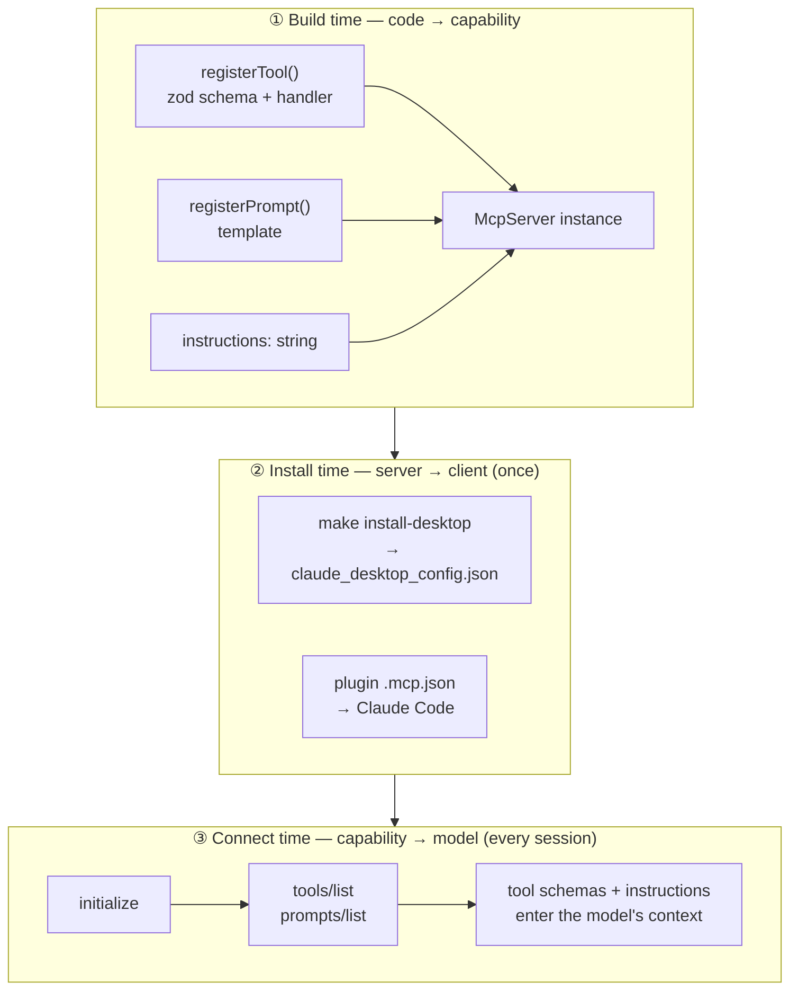
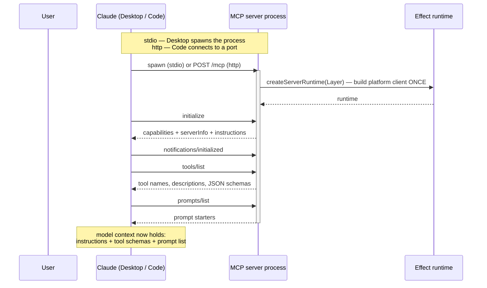
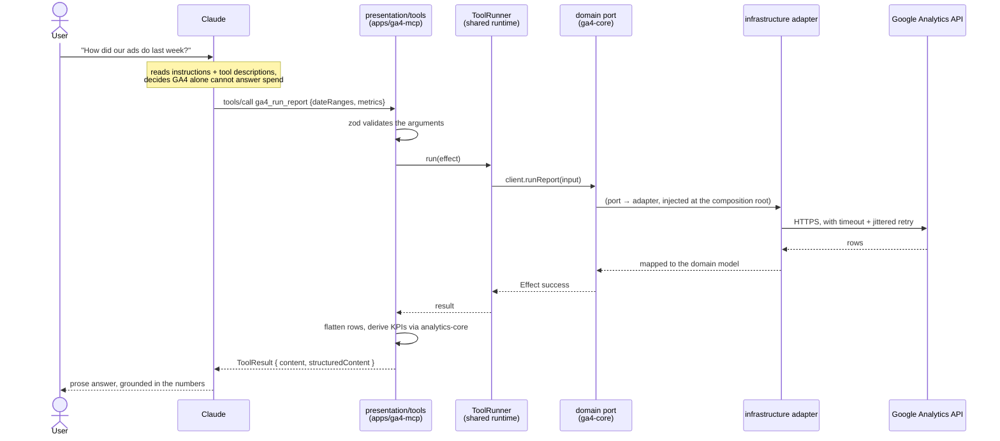
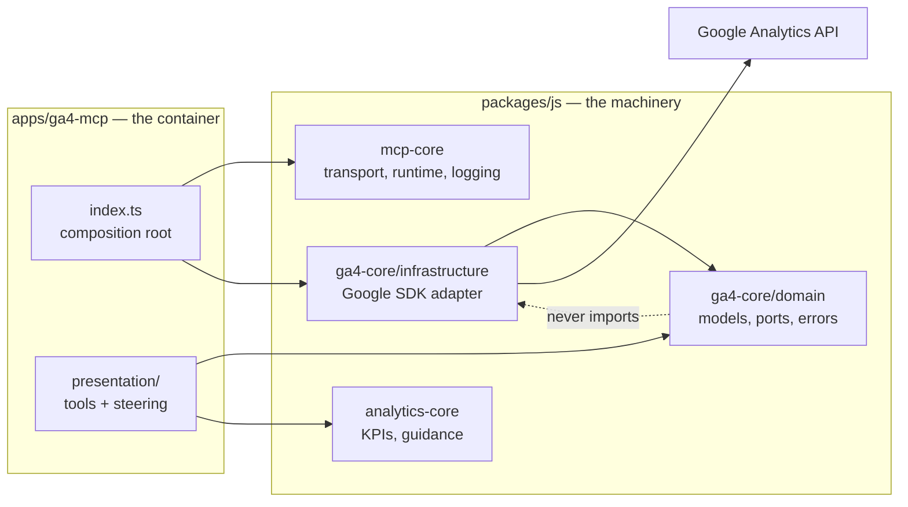

# How it works — primitives, registration, and the flow of a question

What actually happens between a user typing *"how did our ads do last week?"* and a number
coming back. Written for the analytics MCP mode; the same machinery serves every server here.

## 1. The AI primitives

Only four things carry intelligence in this system. Everything else is plumbing.

| Primitive | Who decides to use it | Where it lives here | Reaches |
| --- | --- | --- | --- |
| **Tool** | The **model** — Claude chooses when to call | `apps/*/src/presentation/tools/*.ts` | every MCP client |
| **Prompt** | The **user** — explicitly invoked from the UI | `apps/*/src/presentation/steering.ts` | every MCP client |
| **Instructions** | The **server** — pushed at connect, unasked | `steering.ts` + `analytics-core/domain/guidance.ts` | every MCP client |
| **Skill** | The **model** — loaded when the task matches | `plugin-marketplace/.../skills/analytics/` | clients that support skills |

Two MCP primitives are deliberately **unused**: *resources* (application-controlled
read-only data — our data is parameterised queries, which is what tools are for) and
*sampling* (server asking the client to run an inference — no use for it here).

### Why the split matters

These four are not interchangeable, and choosing wrongly is the most common design mistake.

- **Instructions** always arrive, cost nothing to install, and are read on every connect —
  so they carry the rules that must never be missed, and must stay short. *"A null KPI means
  not-computable, not zero. Money is in the account's own currency."*
- **Tool descriptions** are how the model decides *which* tool — so they say what the tool
  covers and what it does not. GA4's says it knows nothing about ad spend, which is what
  stops Claude trying to compute ROAS from it.
- **Prompts** are the user's entry point when they don't know what to ask. They are full
  request templates, not fragments: *"…compare against the previous period, call out what
  moved, and present a short table plus interpretation — not a data dump."*
- **Skills** are long-form and loaded only when relevant, so they carry the workflows —
  cross-platform reports, brand switching, the attribution trap.

The load-bearing division: **anything that prevents a wrong answer goes in instructions**
(guaranteed to arrive); anything that improves a good answer goes in the skill.

## 2. Registration — three lifecycles, often confused

"Registration" means three different things happening at three different times.

**① Build time.** `registerTool` binds a name, a zod schema and a handler onto an
`McpServer`. This is the only place zod appears — it is the MCP SDK's schema language, and
confined to `presentation/`. Nothing has been exposed to anyone yet.

**② Install time.** The client is told a server *exists*. For Claude Desktop that is an
entry in `claude_desktop_config.json` naming a command to spawn; for Claude Code it is the
plugin's `.mcp.json` naming a URL to connect to. This happens once, and is the only step a
user performs.

**③ Connect time.** On every session the client performs the MCP handshake and asks what the
server can do. The answers — tool schemas, prompt list, instructions — go into the model's
context. **This is why a code change needs only a reconnect, not a restarted session:** the
factory runs again and returns the new definitions.

## 3. Connecting — the handshake

The platform client (GA4, Meta, Shopify, Google Ads) is constructed **once**, when the
runtime is built — not per request. Getting that wrong meant a fresh client, and a fresh
auth handshake, on every single tool call.

## 4. Answering a question — the full path

**Errors never throw.** A failure travels the Effect error channel as a tagged error
(`GA4QuotaError`, `MetaAuthError`, `TimeoutError`) and is converted at the presentation
boundary into a `ToolResult` with `isError: true` and a message the model can act on —
*"the token is expired, retrying will not help"*. The model sees a result, not an exception,
so it can tell the user something useful instead of failing opaquely.

## 5. Where the layers sit

The dotted line is enforced, not aspirational: `.dependency-cruiser.cjs` fails the build if
`domain/` imports `infrastructure/`. The app holds no business logic — swap the transport,
or call `ga4-core` from a worker, and nothing in the domain changes.

## 6. The two ways a user gets here

| | Claude Desktop | Claude Code |
| --- | --- | --- |
| Install | `make install-desktop` | `claude plugin install mndy-mcp@mndy` |
| Transport | **stdio** — Desktop spawns the process | **http** — connects to a port |
| Lifecycle | automatic; nothing to start | `make start-analytics-mcps` |
| After a code change | rebuild, restart Desktop | `make restart-analytics-mcps`, then `/mcp` |
| Gets instructions + prompts | yes | yes |
| Gets the `analytics` skill | via the skill install | via the plugin |

Both paths run the same binary. The transport is a deployment choice (`MCP_TRANSPORT`), not
a code difference.

## 7. What this buys

A user who has never seen this repo opens Claude Desktop and asks a question in English.
Claude already knows — without anyone installing steering — which server owns which data,
that a null KPI is not zero, that the money is in ZAR, and that Shopify is the truth about
revenue while the ad platforms each over-claim credit. It calls two or three read-only tools
across different vendors, and answers in prose with the numbers behind it.

The parts that make that work are ordinary: a typed domain in a package, adapters behind
ports, one runtime per process, errors as values, and guidance shipped with the thing it
describes rather than alongside it.
